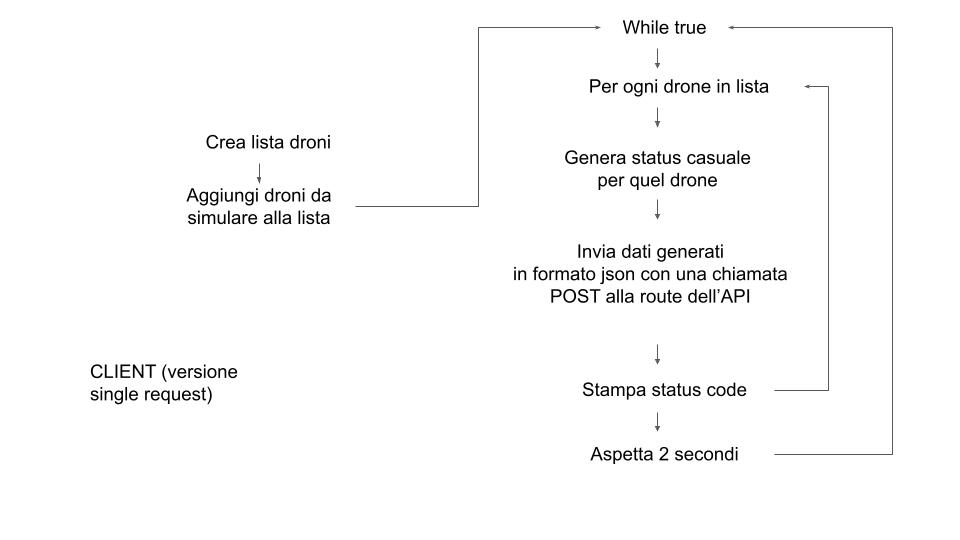
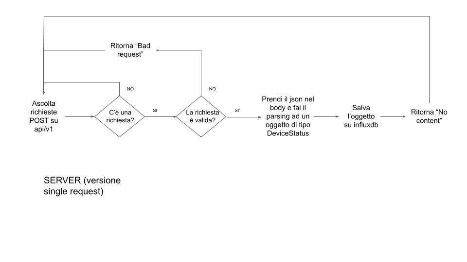

# Protocolli-IoT
## Gruppo: 
- Matteo Faraoni
- Kevin Mainardis

## HTTP
### Messaggi di stato
Ci adeguiamo al livello 2 del Richardson Maturity Model implementando un metodo POST che risponde a: <br>
`url/v1/DroneStatus` con il seguente payload JSON:
```json
{
"DroneId": 0,
"Position":	{
    "X": 37.44742933541882,
    "Y": 89.61939236131468,
    "Z": 793.3927647738683
    },   
"Velocity": 105.075714,
"Battery": 82,
"Timestamp": 1638459750
}
```
Ad ogni richiesta rispondiamo con:
- 204 No Content in caso di inserimento corretto
- 400 Bad Request in caso di payload non compatibile
- 500 Internal Server Error in caso di fallimento durante il salvataggio nel database

Il versionamento è effettuato tramite url e la documentazione è fornita tramite Swagger.


## Flowchart
### Client


### Server

